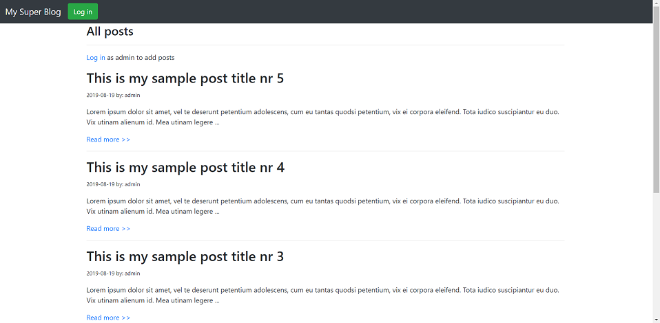
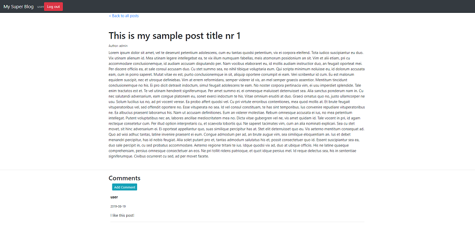
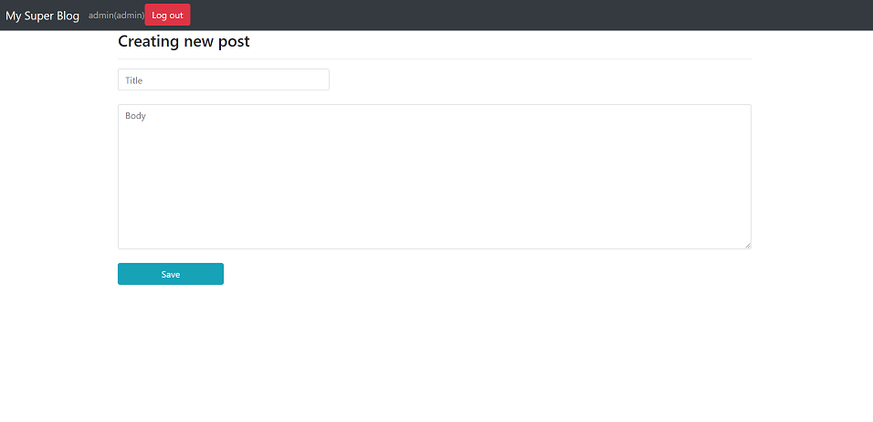

# spring-blog
Spring Boot blog app
## About
This is a simple blogging application.




The security configuration:
- everybody can view the posts and comments
- authenticated users (with ROLE_USER and ROLE_ADMIN) can add comments
- only users with ROLE_ADMIN can add posts
## Technologies used
Spring Boot, Spring MVC, Spring Security, Spring Data JPA, Hibernate, Thymeleaf.
It is connecting to a MySQL Database.
## How to run
To run the app make sure your username and password to access MySQL db are matching with application.properties file. 
You also need to have a database created with name matching the configuration. 
There is no need to create specific tables because Hibernate will do it automatically.

```
spring.datasource.url=jdbc:mysql://localhost:3306/blog2?useSSL=false&serverTimezone=UTC
spring.datasource.username=root
spring.datasource.password=root
```
